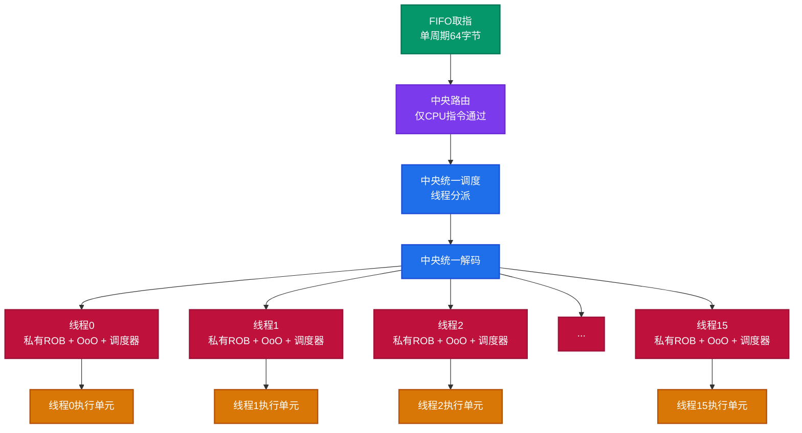

# NIS_Microarchitecture Main v1.0

```mermaid
flowchart TD
    classDef fetch fill:#059669,stroke:#047857,stroke-width:2px,color:#fff
    classDef route fill:#7c3aed,stroke:#6d28d9,stroke-width:2px,color:#fff
    classDef decode fill:#1f6feb,stroke:#1d4ed8,stroke-width:2px,color:#fff
    classDef thread fill:#d97706,stroke:#b45309,stroke-width:2px,color:#fff
    classDef rob fill:#be123c,stroke:#9f1239,stroke-width:2px,color:#fff

    FE["FIFO取指<br/>单周期64字节"] --> RT["中央路由<br/>仅CPU指令通过"]
    
    RT --> SCH["中央统一调度<br/>线程分派"]
    SCH --> DEC["中央统一解码"]
    
    DEC --> T0["线程0<br/>私有ROB + OoO + 调度器"]
    DEC --> T1["线程1<br/>私有ROB + OoO + 调度器"]
    DEC --> T2["线程2<br/>私有ROB + OoO + 调度器"]
    DEC --> TE["..."]
    DEC --> T15["线程15<br/>私有ROB + OoO + 调度器"]
    
    T0 --> EX0["线程0执行单元"]
    T1 --> EX1["线程1执行单元"]
    T2 --> EX2["线程2执行单元"]
    T15 --> EX15["线程15执行单元"]
    
    class FE fetch
    class RT route
    class SCH,DEC decode
    class T0,T1,T2,TE,T15 rob
    class EX0,EX1,EX2,EX15 thread

```