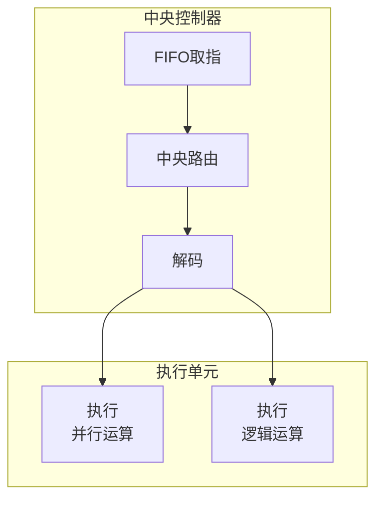

# NIS_Microarchitecture Main v1.0

```mermaid
flowchart TD
    subgraph CTRL["中央控制器"]
        direction TB
        I1[FIFO取指] --> J1[中央路由]
        J1 --> J2[解码]
    end

    subgraph EXEC["执行单元"]
        direction LR
        A[执行<br/>并行运算]
        B[执行<br/>逻辑运算]
    end

    J2 --> A
    J2 --> B
```